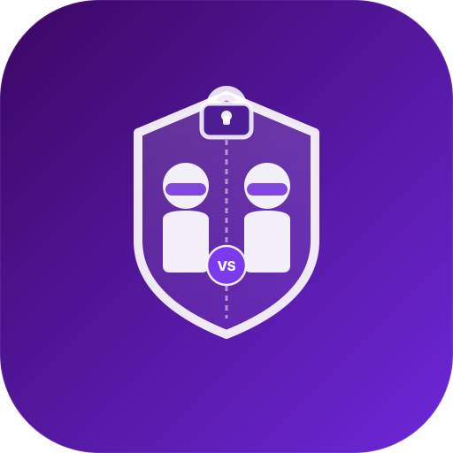

# 🔐 Anonymous Comparator

<div align="center">



<br /><br />

**A privacy-first anonymous comparison platform powered by client-side encryption**

*Your data. Your secret. Always.*

[](https://react.dev)
[](https://www.typescriptlang.org)
[](https://tailwindcss.com)
[](https://vitejs.dev)

</div>

---

## ✨ What is this?

**Anonymous Comparator** is a fun, privacy-respecting platform that lets you compare sensitive personal data with others — without ever revealing the actual numbers.

You'll only ever learn whether you **won**, **lost**, or **tied**. The other person's exact value? Hidden. Forever.

---

## 🎮 Three Ways to Play

### 👤 Solo Mode
Enter your value and compare yourself against a global anonymous database. See exactly which **percentile** you fall into.

```
Your salary  →  Higher than 78% of people
Your height  →  Higher than 62% of people
```

### ⚔️ Random Battle
Get matched with a live anonymous player. Your values are compared in encrypted form — only the **outcome** is revealed. No numbers, no leaks.

### 🔗 Invite PK *(New)*
Generate a personal challenge link and send it to whoever you want to challenge. They click, enter their value, and get the result — without ever seeing yours.

```
You  →  Generate link  →  Send to friend
Friend  →  Click link  →  Enter value  →  See result (Win / Lose / Draw)
                ↑
     Your exact value is never shown to them
```

---

## 🔒 Privacy Principles

These are non-negotiable design rules — not features, but foundations:

| What you want to know | What you actually see |
|-----------------------|----------------------|
| Your own percentile rank | ✅ Shown in Solo Mode |
| Battle outcome | ✅ Win / Lose / Draw |
| Opponent's exact value | ❌ Never shown |
| The gap between values | ❌ Never shown |
| Your raw data sent to a server | ❌ Never happens |

> **Private comparison happens in the browsers.** The signaling service only helps peers find each other; raw values are not sent to the server.

---

## 📊 Comparison Categories

| Category | Icon | Range |
|----------|------|-------|
| Annual Salary | 💰 | 0 – 1,000 万 |
| Height | 📏 | 140 – 220 cm |
| Age | 🎂 | 18 – 100 yrs |
| Length | 🍆 | You know which one |

---

## 🛠️ Tech Stack

```
Framework      React 18 + TypeScript
Styling        Tailwind CSS v4
Animation      Motion (formerly Framer Motion)
Icons          Lucide React
Confetti FX    canvas-confetti
Privacy Layer  WebRTC DataChannel + mpz wasm + Chou-Orlandi/KOS OT
Build Tool     Vite
Package Mgr    npm
```

### How the Invite Link Works

Invite links contain only a category id and a random room id:

```
https://yourapp.com/#challenge=eyJjIjoic2FsYXJ5IiwiciI6InJvb20taWQifQ
                                └─────────────────────────┘
                                  base64({ c: "salary", r: "room-id" })
```

**Why this is private:**
- The link does **not** contain either player's value
- A lightweight signaling server relays WebRTC offer / answer / ICE messages
- Browsers then compare over a WebRTC DataChannel using the mpz wasm protocol engine
- The result screen shows only Win / Lose / Draw — no raw values on either side

---

## 🚀 Getting Started

```bash
# Install dependencies
npm install

# Start the app and signaling server
npm run dev:all

# Run tests
npm test

# Build wasm + frontend
npm run build

# Smoke-test the invite flow in two browser pages
npm run smoke:webrtc
```

---

## 📁 Project Structure

```
src/
└── app/
    ├── App.tsx                   # Root component — state & routing
    └── components/
        ├── ModeSelector.tsx      # Pick a mode: Solo / Battle / Invite
        ├── CompareCategories.tsx # Choose a comparison category
        ├── CompareForm.tsx       # Value input form
        ├── CompareResult.tsx     # Solo mode percentile result
        ├── BattleMatching.tsx    # Animated matchmaking screen
        ├── BattleResult.tsx      # Battle outcome (privacy-safe)
        ├── InviteChallenge.tsx   # Generate & share challenge link
        └── InviteAccept.tsx      # Accept a challenge from a link
server/
└── signaling.mjs                 # WebRTC signaling relay
wasm/
└── mpz-compare/                  # SecureCompare-owned mpz wasm adapter
src/app/protocol/
├── webrtcChallenge.ts            # Invite room + WebRTC handshake
├── mpzProtocolEngine.ts          # DataChannel byte pump into wasm
└── challengeToken.ts             # Category + room token
```

---

## 🎨 Design Philosophy

**Fun comes first** — encryption and privacy are serious topics, but they don't have to feel serious. Everything here is game-ified: matchmaking animations, confetti on wins, dramatic reveal sequences.

**Privacy is the floor, not a feature** — in no scenario does any interface element expose an opponent's exact value. This isn't a toggle; it's hardcoded into every result screen.

**Zero friction** — no sign-up, no account, no tracking. Open the app and play.

**Local-first comparison** — private values stay in the browsers. The only server-side piece in invite mode is the signaling relay needed to establish the peer-to-peer DataChannel.

---

## 🗺️ Roadmap Ideas

- [ ] More categories (net worth, bench press, sleep hours...)
- [ ] Persistent challenge links with expiry tokens
- [ ] Leaderboard based on win streaks (anonymised)
- [ ] QR code generation for in-person PK battles
- [ ] TURN relay for difficult NAT environments
- [ ] Security review of mpz OT parameters and browser threat model

---

<div align="center">

**🔐 Your data belongs to you — and only you.**

*Built with React, TypeScript, and a deep respect for privacy.*

</div>
