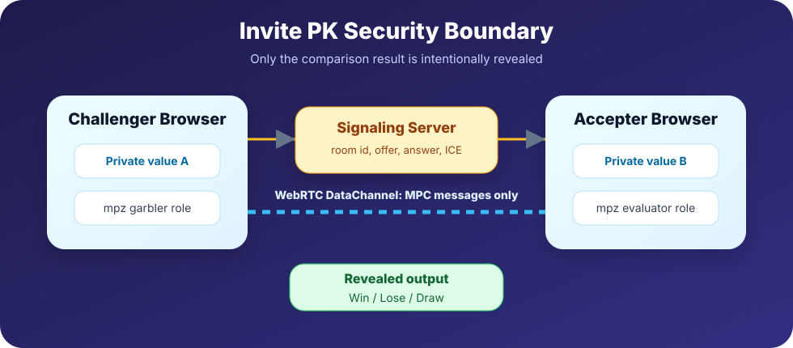
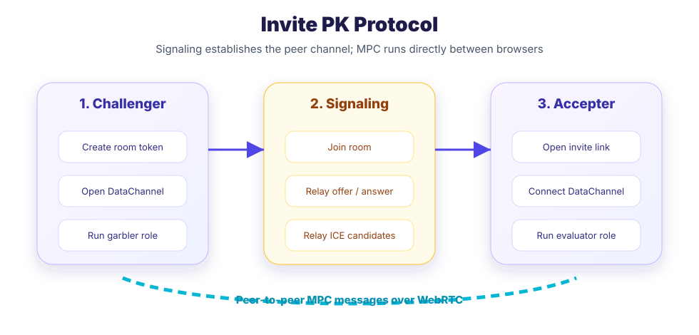
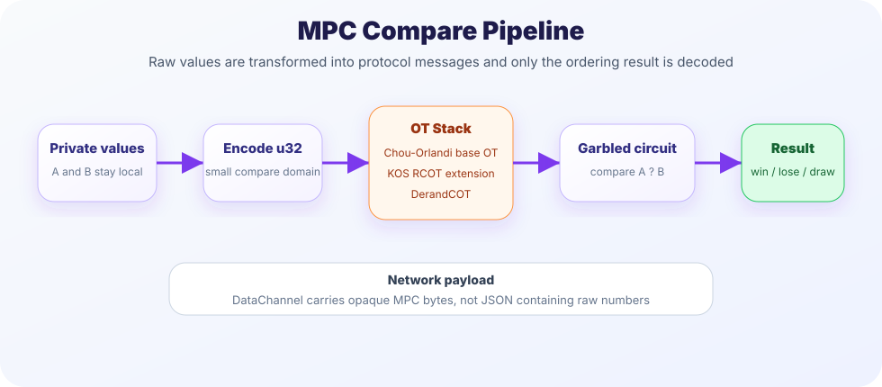

> [!WARNING]
> **Development Version** — Only **Invite PK** mode is fully functional at this time. Solo Mode and Random Battle are still under active development and may not work as expected.

# 🔐 Anonymous Comparator

<div align="center">


<br /><br />

**A privacy-first anonymous comparison platform powered by client-side encryption**

*Your data. Your secret. Always.*

[](https://react.dev)
[](https://www.typescriptlang.org)
[](https://tailwindcss.com)
[](https://vitejs.dev)

</div>

---

## ✨ What is this?

**Anonymous Comparator** is a fun, privacy-respecting platform that lets you compare sensitive personal data with others — without ever revealing the actual numbers.

You'll only ever learn whether you **won**, **lost**, or **tied**. The other person's exact value? Hidden. Forever.

---

## 🎮 Three Ways to Play

### 👤 Solo Mode
Enter your value and compare yourself against a global anonymous database. See exactly which **percentile** you fall into.

```
Your salary  →  Higher than 78% of people
Your height  →  Higher than 62% of people
```

### ⚔️ Random Battle
Get matched with a live anonymous player. Your values are compared in encrypted form — only the **outcome** is revealed. No numbers, no leaks.

### 🔗 Invite PK *(New)*
Generate a personal challenge link and send it to whoever you want to challenge. They click, enter their value, and get the result — without ever seeing yours.

```
You  →  Generate link  →  Send to friend
Friend  →  Click link  →  Enter value  →  See result (Win / Lose / Draw)
                ↑
     Your exact value is never shown to them
```

---

## 🔒 Privacy Principles

These are non-negotiable design rules — not features, but foundations:

| What you want to know | What you actually see |
|-----------------------|----------------------|
| Your own percentile rank | ✅ Shown in Solo Mode |
| Battle outcome | ✅ Win / Lose / Draw |
| Opponent's exact value | ❌ Never shown |
| The gap between values | ❌ Never shown |
| Your raw data sent to a server | ❌ Never happens |

> **Private comparison happens in the browsers.** The signaling server is only used for peer discovery and WebRTC negotiation; it does not receive either player's raw value.

---

## Security Model

This section describes the security model for **Invite PK**, the privacy-computing mode this project is converging on. The goal is not to hide the final result; it is to hide the two raw inputs while revealing only `Win / Lose / Draw`.

### 1. Threat Model

The protocol protects each player's private input from the other player and from the signaling server. The server can observe connection metadata such as room creation and signaling timing, but it is not part of the comparison computation.

The expected leakage is intentionally small:

| Data | Visibility |
|------|------------|
| Challenger raw value | Hidden from accepter and server |
| Accepter raw value | Hidden from challenger and server |
| Final comparison result | Revealed to both players |
| WebRTC metadata | Visible to the browser/network stack |
| Signaling messages | Offer / answer / ICE only |



### 2. Invite PK Protocol

Invite PK is split into two planes. The signaling plane only helps the browsers establish a peer-to-peer channel. The comparison plane runs between the two browsers over a WebRTC DataChannel.



In the intended protocol, the challenge token contains a category id and a random room id. It does **not** contain either player's raw value. Once both pages are open, the two browser clients exchange MPC protocol messages directly.

### 3. MPC Compare Pipeline

The comparison engine encodes both values into a small integer domain and evaluates a comparison circuit. The circuit is executed as a two-party garbled-circuit protocol: one browser acts as the garbler, the other as the evaluator.

The OT stack is designed as:

```text
Chou-Orlandi base OT
        ↓
KOS correlated random OT extension
        ↓
DerandCOT
        ↓
mpz garbled comparison circuit
        ↓
Win / Lose / Draw
```



The important design property is that WebRTC carries protocol messages, not JSON payloads containing the original values.

---

## 📊 Comparison Categories

| Category | Icon | Range |
|----------|------|-------|
| Annual Salary | 💰 | 0 – 1,000 万 |
| Height | 📏 | 140 – 220 cm |
| Age | 🎂 | 18 – 100 yrs |
| Length | 🍆 | You know which one |

---

## 🛠️ Tech Stack

```
Framework      React 18 + TypeScript
Styling        Tailwind CSS v4
Animation      Motion (formerly Framer Motion)
Icons          Lucide React
Confetti FX    canvas-confetti
Privacy Layer  WebRTC DataChannel + mpz wasm + OT
Build Tool     Vite
Package Mgr    pnpm
```

### How the Invite Link Works

The invite link carries only routing metadata:

```
https://yourapp.com/#challenge=eyJjIjoic2FsYXJ5IiwiciI6InJvb20taWQifQ
                                └─────────────────────────┘
                                  base64({ c: "salary", r: "room-id" })
```

**Why this is private:**
- The invite token does **not** contain either player's value
- The signaling service relays only WebRTC negotiation messages
- The comparison runs over a browser-to-browser DataChannel
- The result screen shows only Win / Lose / Draw — no raw values on either side

---

## 🚀 Getting Started

```bash
# Install dependencies
pnpm install

# Start the dev server
pnpm dev
```

---

## 📁 Project Structure

```
src/
└── app/
    ├── App.tsx                   # Root component — state & routing
    └── components/
        ├── ModeSelector.tsx      # Pick a mode: Solo / Battle / Invite
        ├── CompareCategories.tsx # Choose a comparison category
        ├── CompareForm.tsx       # Value input form
        ├── CompareResult.tsx     # Solo mode percentile result
        ├── BattleMatching.tsx    # Animated matchmaking screen
        ├── BattleResult.tsx      # Battle outcome (privacy-safe)
        ├── InviteChallenge.tsx   # Generate & share challenge link
        └── InviteAccept.tsx      # Accept a challenge from a link
```

---

## 🎨 Design Philosophy

**Fun comes first** — encryption and privacy are serious topics, but they don't have to feel serious. Everything here is game-ified: matchmaking animations, confetti on wins, dramatic reveal sequences.

**Privacy is the floor, not a feature** — in no scenario does any interface element expose an opponent's exact value. This isn't a toggle; it's hardcoded into every result screen.

**Zero friction** — no sign-up, no account, no tracking. Open the app and play.

**Local-first** — the app works without a backend. All logic runs in the browser. There's nothing to breach.

---

## 🗺️ Roadmap Ideas

- [ ] More categories (net worth, bench press, sleep hours...)
- [ ] Persistent challenge links with expiry tokens
- [ ] Leaderboard based on win streaks (anonymised)
- [ ] QR code generation for in-person PK battles
- [ ] True zero-knowledge proof implementation

---

<div align="center">

**🔐 Your data belongs to you — and only you.**

*Built with React, TypeScript, and a deep respect for privacy.*

</div>
